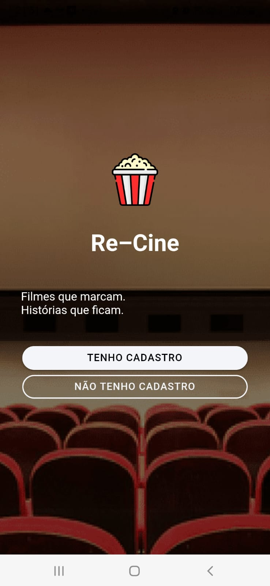
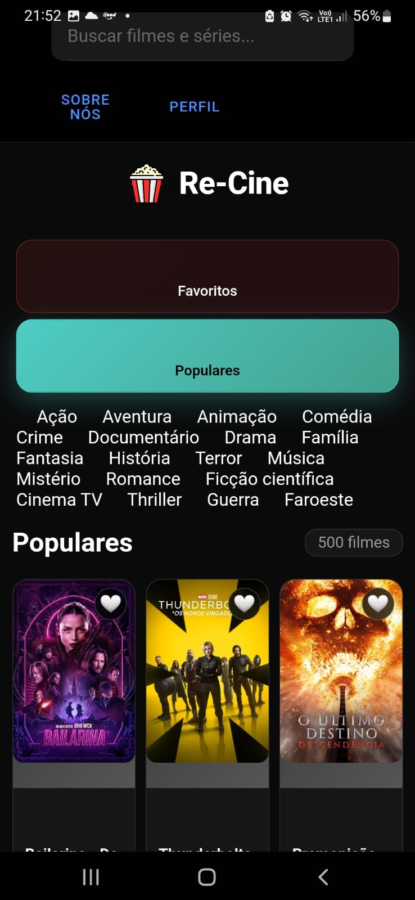
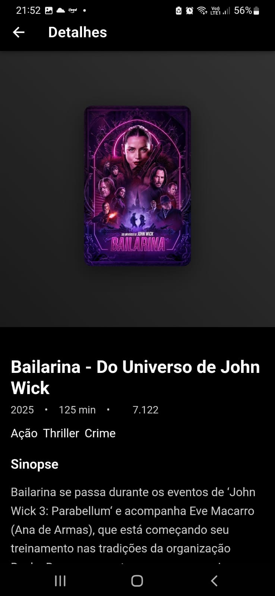

# 🎬 Re-Cine – Catálogo de Filmes

Re-Cine é um aplicativo mobile desenvolvido com **Angular + Ionic** que consome a **API do The Movie Database (TMDb)** para exibir filmes populares com sinopses, filtrá-los por gênero, buscar por título e marcar favoritos.

<p align="center">
  
</p>

## 🚀 Funcionalidades

- ✅ Listagem de filmes populares (até 500)
- 🔍 Busca/pesquisar filmes
- 🎞️ Filtro por gênero (Ação, Comédia, Drama, etc.)
- 🎥 Detalhes de filmes com sinopse e elenco principal
- ❤️ Sistema de favoritos
- 📆 Ordenação por ano ou avaliação
- 🔐 Tela de login com autenticação Firebase
- 👤 Página de perfil do usuário
- 👥 Sobre Nós
  
---

## 🛠️ Tecnologias Utilizadas

- [Angular 17](https://angular.io/)
- [Ionic Framework](https://ionicframework.com/)
- [TypeScript](https://www.typescriptlang.org/)
- [Firebase Auth](https://firebase.google.com/)
- [TMDb API](https://www.themoviedb.org/documentation/api)
- [SCSS](https://sass-lang.com/)

---

## 📱 Layout

> O design do Re-Cine é inspirado em apps modernos de streaming, com navegação por categorias e foco na experiência mobile.

---

<h3>📱 Tela Inicial</h3>


<h3>🎯 Filtro por Gênero</h3>


<h3>🎬 Detalhes do Filme</h3>


---

## 🧪 Como Executar o Projeto

```bash
# Clone o repositório
git clone https://github.com/Arruda-007/app-Re-Cine

# Acesse a pasta
cd app-Re-Cine

# Instale as dependências
npm install

# Rode o projeto em ambiente de desenvolvimento
ionic serve

🔐 Autenticação Firebase
Para acessar a área logada (perfil), é necessário:

Criar uma conta na tela de cadastro
Ou acessar com um usuário válido do Firebase Auth

```
## 📜 Licença
Este projeto está sob a licença MIT.
Sinta-se à vontade para usar, estudar e adaptar. 


